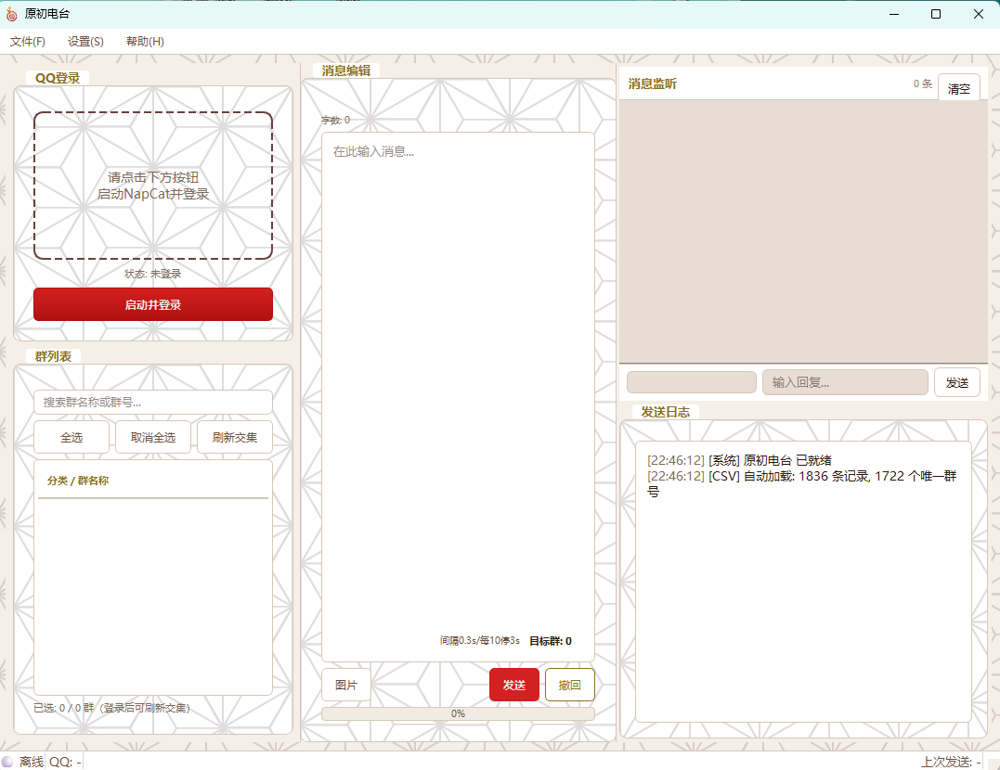

# 原初电台

[](LICENSE)
[](#系统要求)


东方 Project 主题的 QQ 群批量群发工具，基于 NapCat (OneBot v11) 协议。

通过本地注入 QQ NT 通道实现一键向千个群发送消息，支持 CQ 码、断点续传、批量撤回、发送后监听回复等完整群发工作流。

> **下载地址：[thpromoter.dismused-beat.cloud](https://thpromoter.dismused-beat.cloud)** | [GitHub Releases](https://github.com/Horikawa-Raiko/touhou-promoter/releases)



## 功能

- **群列表管理** — 加载本地 CSV 按分类构建群树，支持全选/反选/搜索/右键复制群号，自动与 Bot 群列表取交集
- **一键群发** — 可配置发送间隔、随机抖动、批量暂停，支持图片/CQ 码/@ 等富文本消息
- **断点续传** — 发送中途关闭自动保存进度，下次打开可续发
- **批量撤回** — 一键撤回本轮所有已发消息
- **发送后监听** — 发送完成后自动监听群内 @Bot 及关键词回复，在 QQ 气泡面板中实时显示
- **扫码/快速登录** — 通过 NapCat 拉起 QQ NT 通道，支持二维码扫码登录和 QQ 快捷登录
- **增量同步** — 对接云端服务器自动拉取最新群列表、提交新群
- **深色/浅色主题** — 默认深色，可切换

## 系统要求

| 项目       | 说明                                 |
| -------- | ---------------------------------- |
| **操作系统** | Windows 10/11（后续更新将拓展至MacOS，Linux） |
| **QQ**   | 已安装 QQ NT 客户端（指定版本，经测试9.920-26均可）  |
| **网络**   | 首次启动需下载 NapCat (~30MB)，后续离线可用      |

## 快速开始

从 [官网](https://thpromoter.dismused-beat.cloud) 或 [Releases](https://github.com/Horikawa-Raiko/touhou-promoter/releases) 下载最新 `原初电台.exe`，双击运行。

**首次使用：**

1. 程序自动从 缤纷云 下载 NapCat 到 `%APPDATA%/touhou-promoter/napcat/`
2. 点击「启动并登录」，弹出 QQ 窗口，扫码或快速登录
3. 通过「文件 → 打开 CSV」加载群列表
4. 左侧群树勾选目标群，右侧编辑消息，点击发送

**CSV 格式：**

```csv
群号,分类
123456789,东方同好群
987654321,车万社团
...
```

## 工作原理

```
┌─────────────┐     ┌─────────────┐     ┌─────────────┐
│  原初电台    │────▶│   NapCat    │────▶│  QQ NT      │
│  (PyQt6)    │◀────│  (OneBot)   │◀────│  (注入)     │
└─────────────┘     └─────────────┘     └─────────────┘
   GUI + 引擎       HTTP/WS 协议        QQ 消息通道
```

程序通过 NapCat 注入 QQ NT 进程，以 OneBot v11 标准协议（HTTP API + WebSocket 事件）进行通信。消息发送、群列表获取、事件监听均走此通道，无需操作 QQ 客户端本身。

## 开发

```bash
git clone https://github.com/Horikawa-Raiko/touhou-promoter.git
cd touhou-promoter
pip install -r requirements.txt
python main.py
```

### 依赖

- Python 3.10+
- PyQt6 >= 6.5.0
- requests >= 2.28.0
- websocket-client >= 1.5.0
- qrcode >= 7.4.0
- Pillow >= 9.0.0

### 打包

```bash
pyinstaller touhou_promoter.spec --noconfirm --distpath Desktop
```

输出 `桌面/原初电台.exe`（~48MB，含 Python runtime + PyQt6）。

## 项目结构

```
main.py                          # 入口
touhou_promoter/
├── app.py                       # QApplication 启动流程
├── ui/
│   ├── main_window.py           # 主窗口（三栏布局 + 发送/撤回控制）
│   ├── workers.py               # QThread 工作线程
│   ├── listener_panel.py        # 发送后监听面板（QQ 气泡聊天视图）
│   ├── settings_dialog.py       # 设置对话框
│   └── add_group_dialog.py      # 添加群聊对话框
├── core/
│   ├── onebot_client.py         # OneBot v11 HTTP + WebSocket 客户端
│   ├── forwarding_engine.py     # 发送引擎（限速/抖动/断点续传）
│   ├── napcat_manager.py        # NapCat 子进程管理 + stdout 解析
│   ├── napcat_config.py         # OneBot 配置文件生成
│   ├── napcat_bootstrap.py      # NapCat 自动下载/解压
│   ├── csv_loader.py            # CSV 群列表解析 + 树结构构建
│   ├── group_model.py           # 群数据模型
│   ├── message_builder.py       # 消息编辑 + CQ 码构建
│   ├── post_send_listener.py    # WebSocket 回复监听
│   └── update_checker.py        # 云端增量同步 + 版本更新检查
├── state/
│   ├── app_state.py             # 全局信号总线
│   ├── config_manager.py        # 持久化配置管理
│   └── send_state.py            # 发送会话状态持久化
└── resources/
    └── prompt.json              # 一键群发提示词模板

server/
└── touhou-api.py                # 云端同步服务器（Flask API）
```

## 常见问题

### 这个软件适合我吗？

本软件主要面向以下用户：

1. **需要在特定区域宣发的创作者/社团** — 比如你想把高校例会信息精准推送到本地的东方群。
2. **需要频繁进行群发消息的搬运工** — 软件可以批量勾选群组，提高转发效率。
3. **自己加了大量东方群且有宣发需求的用户** — 软件内置 1800+ 群列表只是全集，加的群越多，宣发覆盖面越广。

### 这个软件安全吗？会上传我的个人信息吗？

**绝对不会。** 软件上传到服务器的内容仅有**经过用户同意的群列表增量信息**，用途仅限于帮助所有用户同步完善群列表，除此之外任何软件运行过程中产生的数据均在本地完成处理。

### 启动报"未找到 QQ"但我明明装了 QQ

原初电台基于 NapCat 框架开发，该框架需要 **Electron 架构的新版 QQ**，旧版 Win32 QQ 不支持。目前已验证 **9.920 ~ 9.926** 均可正常使用。

如果版本太旧或太新，请安装推荐版本：[QQ9.9.26.44343_x64.exe](https://dldir1.qq.com/qqfile/qq/QQNT/40d6045a/QQ9.9.26.44343_x64.exe)

**安装后建议关闭 QQ 自动更新：** QQ 设置 → 软件更新，取消勾选"有更新时自动安装"。

### 扫码登录正常但提示"等待超时"

NapCat 已启动并显示二维码，但软件连不上它的 HTTP 服务（5700 端口）。最常见原因：

1. **QQ 进程残留** — 上次崩溃的 QQ 进程没杀干净。复制以下命令到 PowerShell 运行：
   ```
   taskkill /F /IM QQ.exe; taskkill /F /IM NapCatWinBootMain.exe
   ```
2. **Windows Defender 防火墙弹窗** — 第一次运行时 Windows 可能会弹框，请点"允许"。

### 为什么启动软件后我的 QQ 自动退出了？

这是正常的！NapCat 需要**接管**你的 QQ 进程来实现 Bot 功能。启动时会先关闭你当前的 QQ，然后以注入模式重新拉起。关闭软件后即可重新正常登录 QQ。

### 为什么页面上说 1800+ 群，我的群列表里只有几十个？

群列表里显示的是两个来源的**交集**：

1. **内置 CSV** — 从 THBWiki 爬取的约 1800 个东方群
2. **你 Bot 账号实际加入的群** — 载入群列表时调用 QQ API 获取

软件不能向你不在的群里发送消息。如果你只看到几十个，说明你加入的记录在 THBWiki 中的东方群只有这么多。试试加入更多东方群来提升宣发范围。

### 可以手动添加群聊吗？

可以！菜单 → 群列表 → 添加群聊，填写群号和分类即可。提交时选择**"添加到云端"**，审核通过后所有用户都能同步到。

## 致谢

- [NapCat](https://github.com/NapNeko/NapCatQQ) — QQ NT 注入框架，提供 OneBot v11 协议
- [OneBot v11](https://github.com/botuniverse/onebot-11) — 聊天机器人标准协议
- [PyQt6](https://www.riverbankcomputing.com/software/pyqt/) — Python Qt 绑定
- 帮忙测试的车万人们 Thanks

## License

MIT
